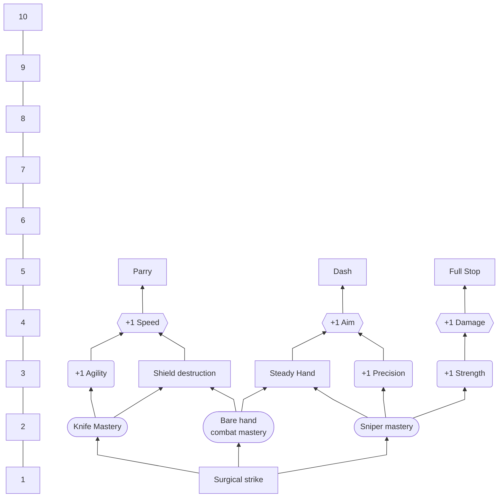

### Overview
### Unique Skill
### Skill Tree

### Leveling Table
| Level |                   Gain                    |
|:-----:|:-----------------------------------------:|
|   1   | Unique Skill, +1 Precision, +1 Reputation |
|   2   |                  +1 Skill point,                    | 
|   3   |                                           |
|   4   |                                           |
|   5   |                                           |
