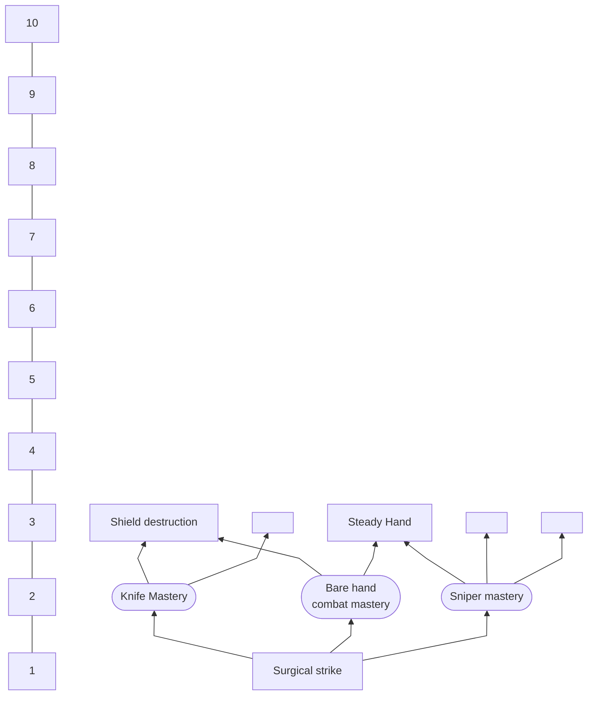

### Overview
### Unique Skill
### Skill Tree

```mermaid
%%{init:{"flowchart":{"curve":"linear"}}}%%
graph BT;
1---2---3---4---5---6---7---8---9---10
us[Surgical strike]-->lvl1.1([Knife Mastery]) & lvl1.3([Bare hand <br> combat mastery]) & lvl1.2([Sniper mastery])
lvl1.3 & lvl1.1 --> lvl2.1[Shield destruction]
lvl1.3 & lvl1.2 --> lvl2.2[Steady Hand]
lvl1.1 --> lvl2.3[ ]
lvl1.2 --> lvl2.4[ ]
lvl1.2 --> lvl2.5[ ] 
```
### Leveling Table